# 🤖 react-agent

[](https://pkg.go.dev/github.com/v8tix/react-agent)
[](https://goreportcard.com/report/github.com/v8tix/react-agent)
[](LICENSE)

**Build AI agents that think before they act.**

Most LLM integrations are one-shot: send a prompt, get an answer. But complex questions require *reasoning* — looking things up, checking results, adjusting the plan. `react-agent` implements the **ReAct pattern** (Reason + Act), a technique where the model alternates between *thinking out loud* and *using tools* until it's confident enough to answer.

> 📄 *Based on ["ReAct: Synergizing Reasoning and Acting in Language Models"](https://arxiv.org/abs/2210.03629) — Yao et al., 2022*

---

## 🧠 What is the ReAct pattern?

> Think of it like a **detective 🕵️** who never guesses. Instead of jumping to a conclusion, they follow a strict method: *form a hypothesis → gather evidence → revise → repeat* until the case is solved.

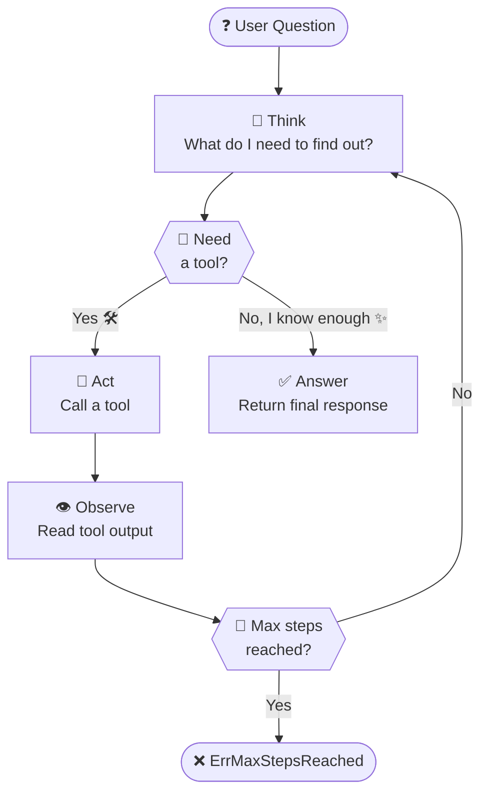

---

## 🔍 A Concrete Example

> *"What was Apple's stock price the day the iPhone was announced?"*

A one-shot model will **guess**. A ReAct agent will **reason**:

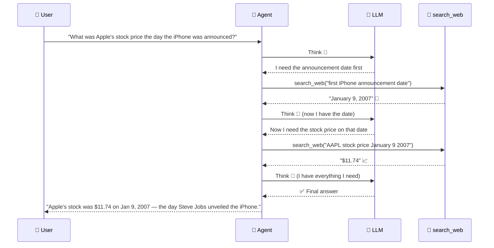

> 💡 Notice how the agent **builds on previous observations** — each step's result is fed back into the next Think. The LLM never loses context.

---

## 📦 Installation

```bash
go get github.com/v8tix/react-agent
```

---

## 🚀 Quick Start

Here's a complete example: a **research assistant** 🔬 that can search the web and do math to answer complex questions.

```go
package main

import (
    "context"
    "fmt"
    "log"

    "github.com/openai/openai-go"
    agent "github.com/v8tix/react-agent"
)

func main() {
    ctx := context.Background()

    // 1️⃣ Wrap your LLM (any OpenAI-compatible endpoint, including LiteLLM)
    openaiClient := openai.NewClient() // reads OPENAI_API_KEY from env
    client := agent.NewLiteLLMClient(openaiClient, "gpt-4o-mini")

    // 2️⃣ Declare the tools the agent can use (OpenAI JSON-schema format)
    defs := []agent.ToolDefinition{
        {
            Name:        "search_web",
            Description: "Search the web for up-to-date information",
            Parameters: map[string]any{
                "type": "object",
                "properties": map[string]any{
                    "query": map[string]any{"type": "string", "description": "The search query"},
                },
                "required": []string{"query"},
            },
        },
        {
            Name:        "calculator",
            Description: "Evaluate a simple arithmetic expression",
            Parameters: map[string]any{
                "type": "object",
                "properties": map[string]any{
                    "expression": map[string]any{"type": "string", "description": "e.g. '42 * 1.2'"},
                },
                "required": []string{"expression"},
            },
        },
    }

    // 3️⃣ Wire up the executor — your code that actually runs the tools
    executor := &myExecutor{}

    // 4️⃣ Build the agent with a fluent builder chain
    a := agent.New(client, defs, executor).
        WithInstructions("You are a precise research assistant. Always verify facts before answering.").
        WithMaxSteps(10)

    // 5️⃣ Run! Returns result, a replayable event stream, and any error.
    result, events, err := a.Run(ctx, "How many seconds did it take the Voyager 1 spacecraft to travel 1 AU?")
    if err != nil {
        log.Fatal(err)
    }

    fmt.Println("🏁 Answer:", result.Output)
    _ = events // see "Observability" section below
}
```

---

## 🏗️ Architecture

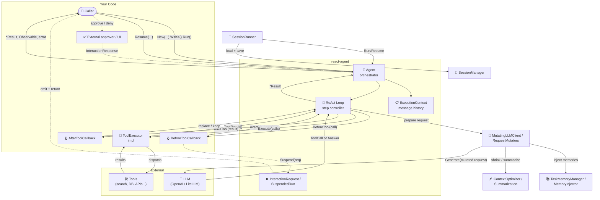

---

## 🔧 Implementing ToolExecutor

The only interface you **must** implement:

```go
type ToolExecutor interface {
    Execute(ctx context.Context, calls []model.ToolCall) ([]model.ToolResult, error)
}
```

A typical implementation dispatches by tool name:

```go
type myExecutor struct {
    searcher WebSearcher
    calc     Calculator
}

func (e *myExecutor) Execute(ctx context.Context, calls []model.ToolCall) ([]model.ToolResult, error) {
    results := make([]model.ToolResult, len(calls))
    for i, call := range calls {
        output, err := e.dispatch(ctx, call.Name, call.Arguments)
        if err != nil {
            results[i] = model.ToolResult{
                ID: call.ID, Name: call.Name,
                Status: "error", Content: []string{err.Error()},
            }
            continue
        }
        results[i] = model.ToolResult{
            ID: call.ID, Name: call.Name,
            Status: "success", Content: []string{output},
        }
    }
    return results, nil
}

func (e *myExecutor) dispatch(ctx context.Context, name, args string) (string, error) {
    switch name {
    case "search_web":
        return e.searcher.Search(ctx, args)
    case "calculator":
        return e.calc.Eval(args)
    default:
        return "", fmt.Errorf("unknown tool: %s", name)
    }
}
```

> 💡 `ToolExecutor` is **the integration seam** — plug in MCP, LangChain tools, a local SQLite, a REST API, anything. The agent doesn't care what's behind it.

---

## 🎓 Learning Flows

> 💡 **Study by scenario, not by type.** Pick the flow that looks like your app, copy the pattern, and then mix flows together as your agent grows up.

### ❓ Where should I start?

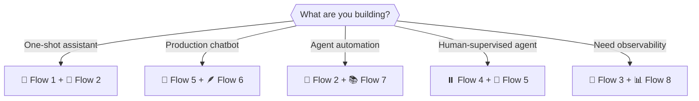

| Flow | Best for | Complexity | Core pieces |
|------|----------|------------|-------------|
| **Flow 1 — 🏃 Basic Run** | direct answers, no tools | ⭐ | `Agent`, `LLMClient` |
| **Flow 2 — 🔧 Tool Use** | search, APIs, calculators | ⭐⭐ | `ToolExecutor`, `ToolDefinition` |
| **Flow 3 — 📡 Event Stream** | logs, tracing, dashboards | ⭐⭐ | `Observable`, `AgentEvent` |
| **Flow 4 — ⏸️ Approval Loop** | risky or destructive tools | ⭐⭐⭐ | `Suspend`, `Resume`, callbacks |
| **Flow 5 — 🧵 Session Continuity** | chat, multi-turn memory | ⭐⭐⭐ | `SessionRunner`, `SessionManager` |
| **Flow 6 — 🪶 Context Optimization** | long conversations | ⭐⭐⭐⭐ | `MutatingLLMClient`, strategies |
| **Flow 7 — 📚 Long-Term Memory** | learning from past tasks | ⭐⭐⭐⭐ | `TaskMemoryManager`, `MemoryInjector` |
| **Flow 8 — 📊 Request Logging** | debugging prompt pipelines | ⭐⭐⭐ | `WithLogger`, `WithMutatorLogger` |

---

### Flow 1 — 🏃 Basic Run: no tools, just reasoning

**Study this flow when:** you want the cleanest possible setup — one prompt in, one answer out.

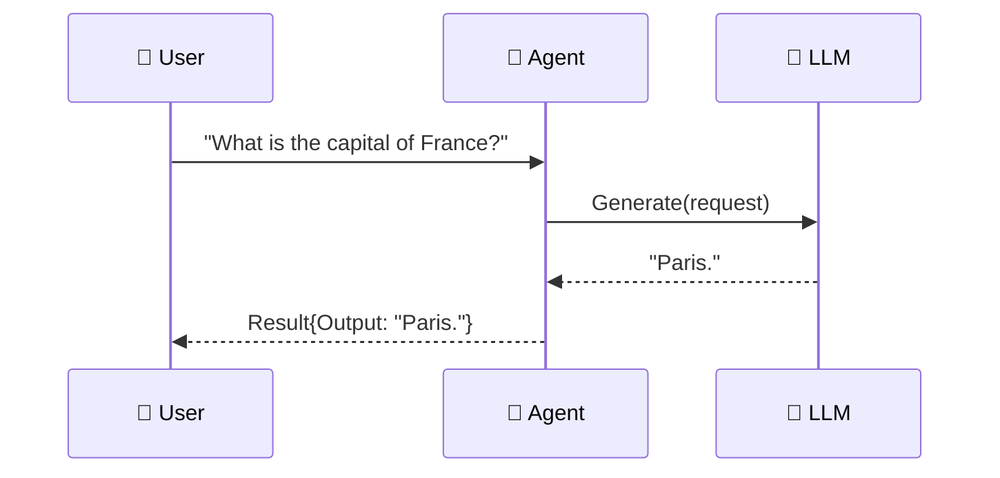

```go
a := agent.New(client, nil, nil).
    WithInstructions("You are a helpful assistant.")

result, _, err := a.Run(ctx, "What is the capital of France?")
if err != nil {
    log.Fatal(err)
}

fmt.Println(result.Output)
fmt.Println("tool called:", result.ToolCalled)
```

> 🙂 Friendly rule of thumb: start here first. If this solves your use case, you probably do **not** need sessions, approvals, or memory yet.

---

### Flow 2 — 🔧 Tool Use: multi-step reasoning with evidence

**Study this flow when:** your model needs to look something up instead of guessing.

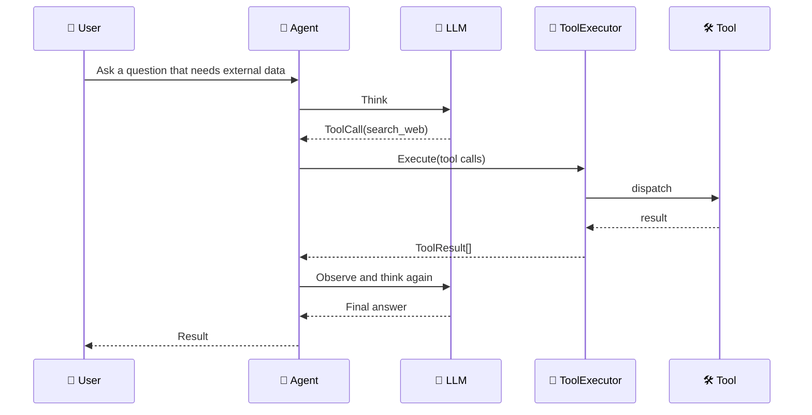

```go
defs := []model.ToolDefinition{{
    Name:        "search_web",
    Description: "Search the web for current information",
    Parameters: map[string]any{
        "type": "object",
        "properties": map[string]any{
            "query": map[string]any{"type": "string"},
        },
        "required": []string{"query"},
    },
}}

a := agent.New(client, defs, executor).
    WithInstructions("Verify facts before answering.")

result, _, err := a.Run(ctx, "What was Apple's stock price the day the iPhone was announced?")
if err != nil {
    log.Fatal(err)
}

fmt.Println(result.Output)
```

**What to study here:**

1. The agent writes `ToolCall` items into history before execution.
2. Your `ToolExecutor` decides how each tool name is actually dispatched.
3. Tool failures are still useful — the model can read them and recover on the next step.

---

### Flow 3 — 📡 Event Stream: observability without extra plumbing

**Study this flow when:** you want to see what the agent is doing while keeping the core orchestration code unchanged.

`Run()` returns three values:

```go
result, events, err := a.Run(ctx, question)
//        ^^^^^^
//        rxgo.Observable — a replayable stream of everything the agent did
```

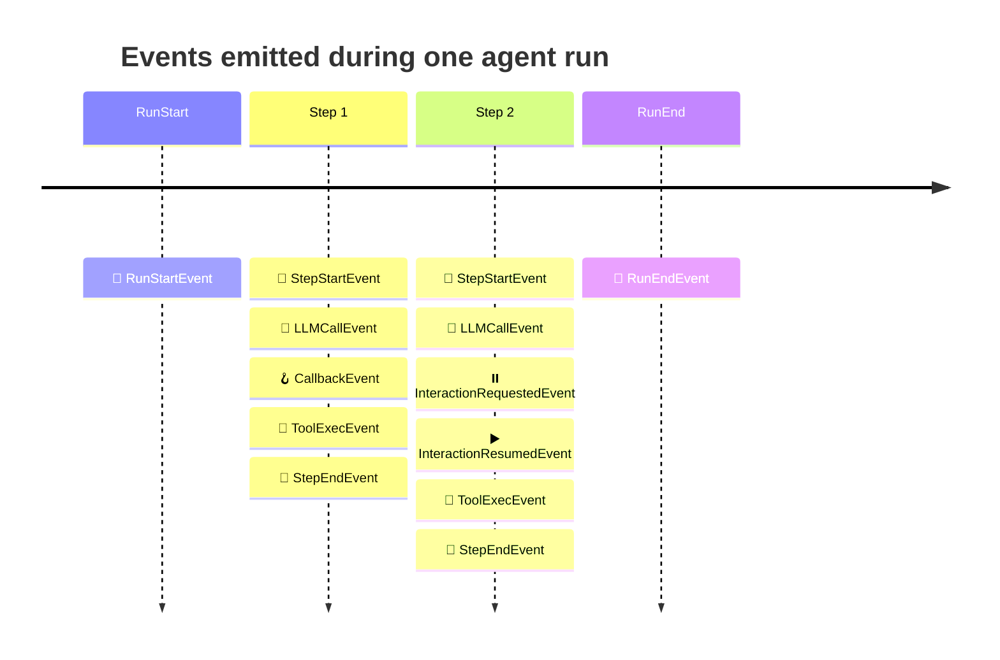

| Event | Why you care |
|------|---------------|
| `RunStartEvent` | identify a run and the original user question |
| `StepStartEvent` / `StepEndEvent` | measure loop progress |
| `LLMCallEvent` | track model latency and failures |
| `CallbackEvent` | observe approval or rewrite hooks |
| `ToolExecEvent` | track tool batches and latency |
| `InteractionRequestedEvent` | surface human input requests |
| `InteractionResumedEvent` | confirm resume handoff |
| `RunEndEvent` | capture final result or terminal error |

```go
result, events, err := a.Run(ctx, question)
if err != nil {
    log.Fatal(err)
}

for item := range events.Observe() {
    switch e := item.V.(type) {
    case agent.RunStartEvent:
        slog.Info("run started", "run_id", e.RunID, "question", e.UserMessage)
    case agent.ToolExecEvent:
        slog.Info("tool exec", "tools", e.ToolNames, "latency_ms", e.Latency.Milliseconds())
    case agent.RunEndEvent:
        slog.Info("run ended", "err", e.Err)
    }
}

fmt.Println(result.Output)
```

> 🧊 **Cold & replayable** — every `Observe()` call replays the full run from the beginning, so one subscriber can log while another records metrics.

---

### Flow 4 — ⏸️ Approval Loop: pause, ask a human, continue safely

**Study this flow when:** a tool can delete, charge, publish, or otherwise do something you want a human to approve.

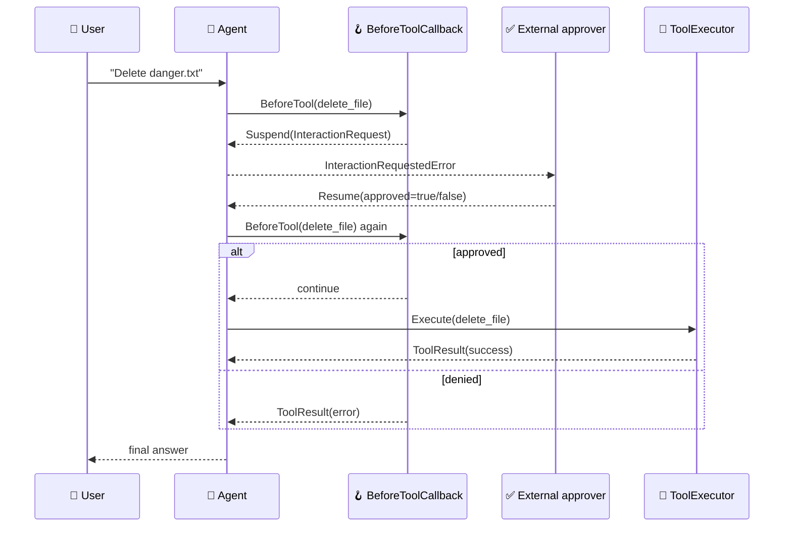

```go
approval := agent.NewConfirmationCallback(agent.StaticApprovalPolicy{
    "delete_file": {
        MessageTemplate: "Approve deleting this file?",
        DeniedMessage:   "Deletion cancelled by user.",
    },
})

a := agent.New(client, defs, executor).
    WithInstructions("Ask for approval before destructive tools.").
    WithBeforeToolCallbacks(approval).
    WithMaxSteps(8)
```

```go
result, _, err := a.Run(ctx, "Delete danger.txt")
if err != nil {
    var suspended *agent.InteractionRequestedError
    if errors.As(err, &suspended) {
        approved := true
        result, _, err = a.Resume(ctx, suspended.Suspended, agent.InteractionResponse{
            RequestID: suspended.Suspended.Interaction.ID,
            Approved:  &approved,
        })
    }
}
```

**Nice built-in detail:** `ConfirmationCallback` automatically redacts sensitive-looking tool arguments before they land in `InteractionRequest.Payload`.

| Payload pattern | How it is handled |
|----------------|-------------------|
| `api_key`, `token`, `password`, `secret` | replaced with `[redacted]` |
| path-like fields | sanitized before being surfaced |
| normal strings | truncated and cleaned for safe display |

---

### Flow 5 — 🧵 Session Continuity: multi-turn conversations without losing context

**Study this flow when:** your caller is not a single CLI invocation — it's a chat UI, API, or worker that talks to the same user over time.

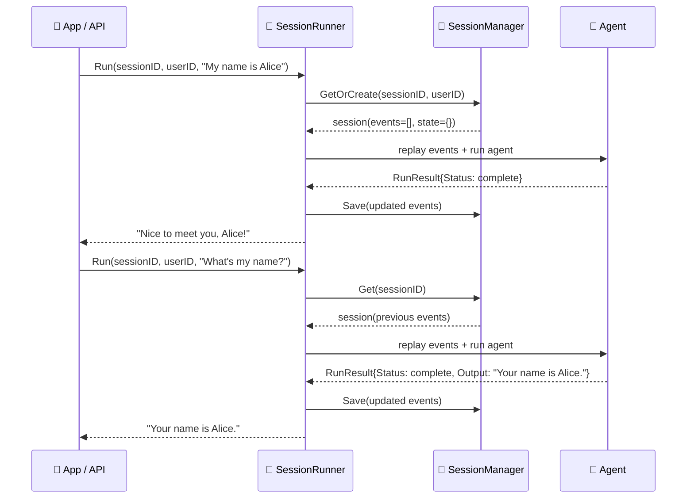

```go
sessions := agent.NewInMemorySessionManager()

runner := agent.NewSessionRunner(
    agent.New(client, defs, executor).WithMaxSteps(8),
    sessions,
    8,
)

first, err := runner.Run(ctx, "chat-42", "user-7", "My name is Alice")
if err != nil {
    log.Fatal(err)
}

second, err := runner.Run(ctx, "chat-42", "user-7", "What's my name?")
if err != nil {
    log.Fatal(err)
}

fmt.Println(first.Status)
fmt.Println(second.Output)
```

**Study notes:**

1. `SessionRunner` replays stored `model.Event` values into a fresh execution context.
2. The session store is pluggable — `InMemorySessionManager` is just the starter version.
3. If a session suspends, you get `StatusPending` and can continue later with `runner.Resume(...)`.

---

### Flow 6 — 🪶 Context Optimization: managing token budgets without going blind

**Study this flow when:** your conversation gets long, tool outputs get noisy, or the model starts forgetting important recent context.

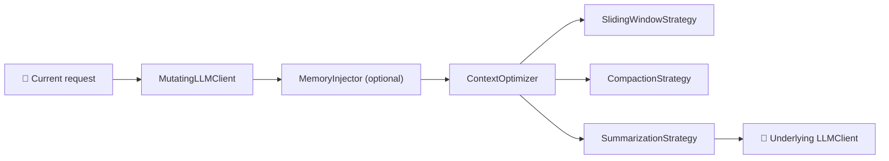

```go
counter, err := agent.NewRequestTokenCounter("gpt-4o-mini")
if err != nil {
    log.Fatal(err)
}

optimizedClient := agent.NewMutatingLLMClient(
    client,
    agent.WithMutatorLogger(
        agent.NewContextOptimizer(
            counter,
            8_000,
            agent.NewSlidingWindowStrategy(8),
            agent.NewCompactionStrategy(),
        ),
        slog.Default(),
    ),
)

a := agent.New(optimizedClient, defs, executor).WithMaxSteps(12)
```

| Strategy | What it does | Best when |
|----------|---------------|-----------|
| `SlidingWindowStrategy` | keeps the last user turn plus a recent tail | you only need fresh context |
| `CompactionStrategy` | shrinks bulky tool payloads into short summaries | tools return huge blobs |
| `SummarizationStrategy` | moves older history into a generated summary | conversations are long but earlier turns still matter |

> 🧠 Think of this as luggage management for prompts: keep the passport, fold the clothes, and summarize the travel diary.

---

### Flow 7 — 📚 Long-Term Task Memory: learning from similar problems

**Study this flow when:** your agent solves recurring task shapes and you want it to reuse successful approaches next time.

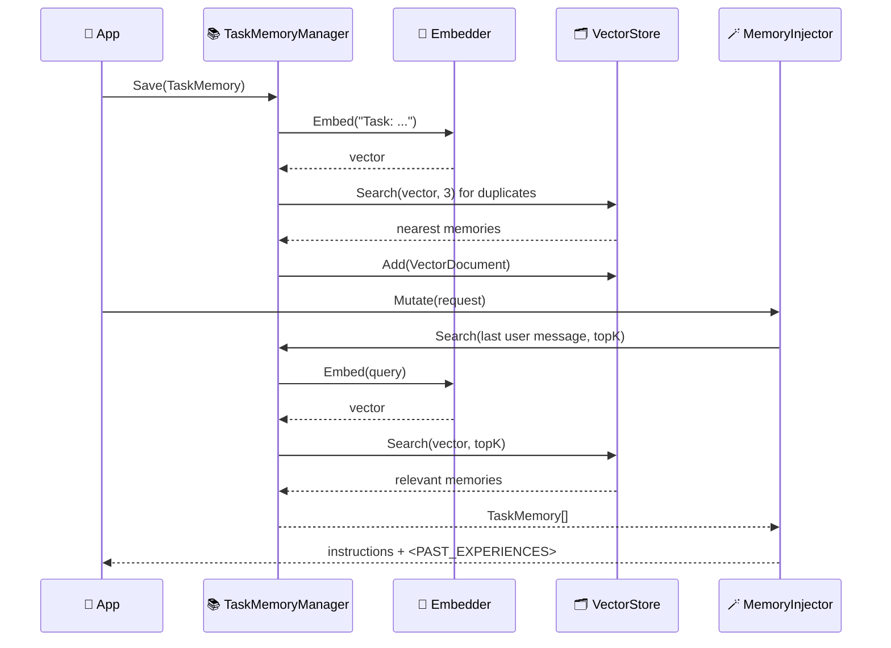

```go
memories := agent.NewTaskMemoryManager(
    embedder,
    agent.NewInMemoryVectorStore(),
    agent.SimpleDuplicateChecker{},
)

if _, saved, err := memories.Save(ctx, agent.TaskMemory{
    TaskSummary: "find capitals",
    Approach:    "used search",
    FinalAnswer: "Paris",
    IsCorrect:   true,
}); err != nil {
    log.Fatal(err)
} else if saved {
    fmt.Println("memory stored")
}

clientWithMemory := agent.NewMutatingLLMClient(
    client,
    agent.NewMemoryInjector(memories, 3),
)
```

| Field | What to put there |
|------|--------------------|
| `TaskSummary` | short description of the problem |
| `Approach` | how the agent solved it |
| `FinalAnswer` | the final answer or resolution |
| `IsCorrect` | whether the solution should be reused confidently |
| `ErrorAnalysis` | what went wrong when a result was bad |

Stored memories and injected text are sanitized before reuse, so prompt-injection strings and sensitive-looking paths do not get copied back into the model context verbatim.

---

### Flow 8 — 📊 Request Logging: see the mutator pipeline in action

**Study this flow when:** you want to debug why a prompt got shorter, why memories were injected, or why an approval flow suspended.

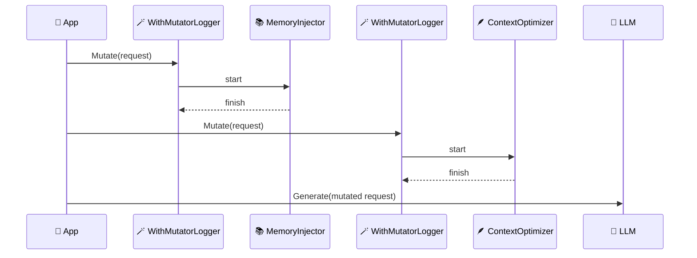

```go
logger := slog.Default()

memories := agent.NewTaskMemoryManager(embedder, agent.NewInMemoryVectorStore(), agent.SimpleDuplicateChecker{}).
    WithLogger(logger)

counter, err := agent.NewRequestTokenCounter("gpt-4o-mini")
if err != nil {
    log.Fatal(err)
}

clientWithPipelineLogs := agent.NewMutatingLLMClient(
    client,
    agent.WithMutatorLogger(agent.NewMemoryInjector(memories, 3), logger),
    agent.WithMutatorLogger(
        agent.NewContextOptimizer(
            counter,
            8_000,
            agent.NewSlidingWindowStrategy(8),
            agent.NewCompactionStrategy(),
        ).WithLogger(logger),
        logger,
    ),
)
```

**Typical things you'll see in logs:**

1. `memory_search_start` / `memory_search_end`
2. `mutator_start` / `mutator_finish`
3. `context_optimize_start`
4. `context_strategy_apply` / `context_strategy_applied`
5. `session_run_start` / `session_run_end`
6. `approval_requested`

---

## 🔗 Flow Combinations

Real systems usually mix more than one flow:

| Your use case | Combine these flows | Why |
|---------------|---------------------|-----|
| **Production chatbot** | Flow 3 + Flow 5 + Flow 6 | observe runs, persist turns, keep prompts small |
| **Risky automation** | Flow 2 + Flow 4 + Flow 8 | use tools, gate them, log every decision |
| **Research assistant** | Flow 2 + Flow 3 + Flow 7 | fetch evidence, inspect reasoning, reuse good prior work |
| **Support agent** | Flow 5 + Flow 6 + Flow 7 | remember the conversation, manage token budget, learn from resolved cases |

> 🧩 The library is intentionally composable: sessions, approvals, mutators, memory, and event streams are designed to stack cleanly instead of forcing one giant framework.

---

## 🕹️ Manual Step Control

`Step` is still available when you want to drive the loop yourself — useful for streaming UI updates, custom checkpoints, or research/debug flows where you want to inspect each step manually:

```go
execCtx := agent.NewExecutionContextForTest()
execCtx.AddEvent("user", model.Message{Role: "user", Content: "Plan a 3-day trip to Kyoto"})

for execCtx.CurrentStep() < 15 {
    if err := a.Step(ctx, execCtx); err != nil {
        break
    }
    if execCtx.Done() {
        break
    }

    latest := execCtx.Events()[len(execCtx.Events())-1]
    fmt.Printf("step %d: %s emitted %d item(s)\n", execCtx.CurrentStep(), latest.Author, len(latest.Content))

    execCtx.IncrementStep()
}
```

---

## 🔍 Inspecting the Reasoning Trail

Every run keeps a full, ordered history of messages, tool calls, and tool results in `result.Context`:

```go
for _, event := range result.Context.Events() {
        fmt.Printf("[%s] at %s\n", event.Author, event.Timestamp.Format(time.RFC3339))
    for _, item := range event.Content {
        switch v := item.(type) {
        case model.Message:
            fmt.Printf("  💬 message: %s\n", v.Content)
        case model.ToolCall:
            fmt.Printf("  🔧 tool_call: %s(%s)\n", v.Name, v.Arguments)
        case model.ToolResult:
            fmt.Printf("  📊 tool_result: [%s] %v\n", v.Status, v.Content)
        }
    }
}
```

> 💡 Use this for **debugging**, **audit logs**, or displaying the agent's "chain of thought" to end users.

---

## 🏛️ Design Reference

```mermaid
classDiagram
    class Agent {
        +Run(ctx, question) Result, Observable, error
        +Resume(ctx, suspended, response) Result, Observable, error
        +Step(ctx, execCtx) error
        +Think(ctx, execCtx) error
        +Act(ctx, execCtx) error
        +WithInstructions(string) Agent
        +WithMaxSteps(int) Agent
        +WithBeforeToolCallbacks(...BeforeToolCallback) Agent
        +WithAfterToolCallbacks(...AfterToolCallback) Agent
    }

    class LLMClient {
        <<interface>>
        +Generate(ctx, req) Response, error
    }

    class ToolExecutor {
        <<interface>>
        +Execute(ctx, calls) ToolResults, error
    }

    class BeforeToolCallback {
        <<interface>>
        +BeforeTool(ctx, execCtx, call) ToolResult, error
    }

    class AfterToolCallback {
        <<interface>>
        +AfterTool(ctx, execCtx, result) ToolResult, error
    }

    class ExecutionContext {
        +Events() []Event
        +AddEvent(author, items)
        +CurrentStep() int
        +IncrementStep()
        +PendingInteraction() *InteractionRequest, bool
        +InteractionResponse(requestID) InteractionResponse, bool
    }

    class SuspendedRun {
        +Context ExecutionContext
        +Interaction InteractionRequest
    }

    class InteractionRequest {
        +ID string
        +Kind string
        +Prompt string
        +ToolCallID string
        +ToolName string
    }

    class InteractionResponse {
        +RequestID string
        +Approved *bool
        +Value string
    }

    class AgentEvent {
        <<interface sealed>>
        RunStartEvent
        StepStartEvent
        LLMCallEvent
        CallbackEvent
        ToolExecEvent
        InteractionRequestedEvent
        InteractionResumedEvent
        StepEndEvent
        RunEndEvent
    }

    Agent --> LLMClient : uses
    Agent --> ToolExecutor : uses
    Agent --> BeforeToolCallback : uses
    Agent --> AfterToolCallback : uses
    Agent --> ExecutionContext : owns
    Agent --> SuspendedRun : resumes
    Agent ..> AgentEvent : emits via Observable
    InteractionRequestedEvent --> InteractionRequest : carries
    InteractionResumedEvent --> InteractionResponse : carries
```

| Type | Role |
|------|------|
| `Agent` | 🤖 Orchestrator — owns the loop |
| `ExecutionContext` | 📋 Mutable run state — thread-safe event log |
| `Event` | 📝 Timestamped history entry (author + content items) |
| `LLMClient` | 🧠 Interface — swap any provider |
| `ToolExecutor` | 🔧 Interface — bring your own dispatch strategy |
| `LiteLLMClient` | 🔌 Concrete adapter for openai-go / LiteLLM proxy |
| `MutatingLLMClient` | 🧠 Request pipeline — inject memory, optimize, sanitize |
| `SessionRunner` | 🧵 Conversation wrapper — replay, persist, resume |
| `TaskMemoryManager` | 📚 Long-term memory store — save and search past tasks |
| `ConfirmationCallback` | ✅ Human approval gate for selected tools |
| `AgentEvent` | 📡 Sealed sum type — emitted on the observable stream |

---

## License

MIT
