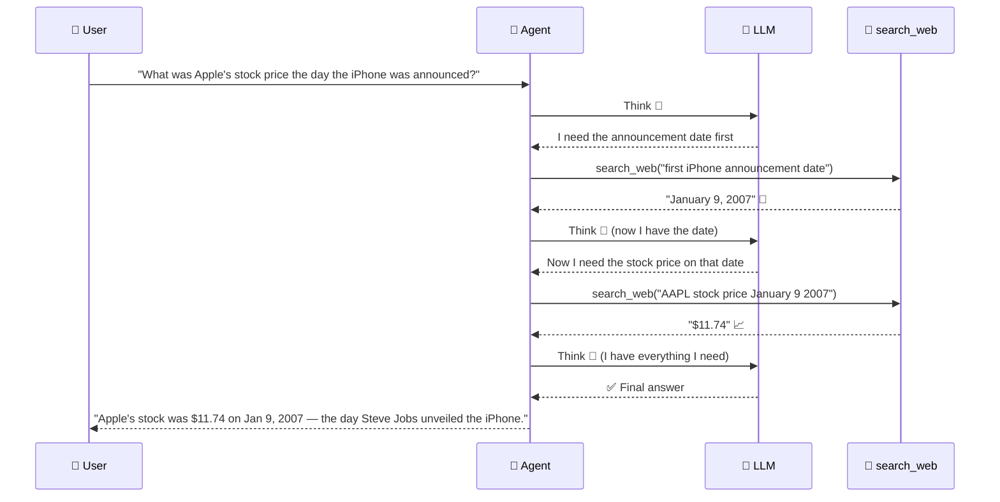
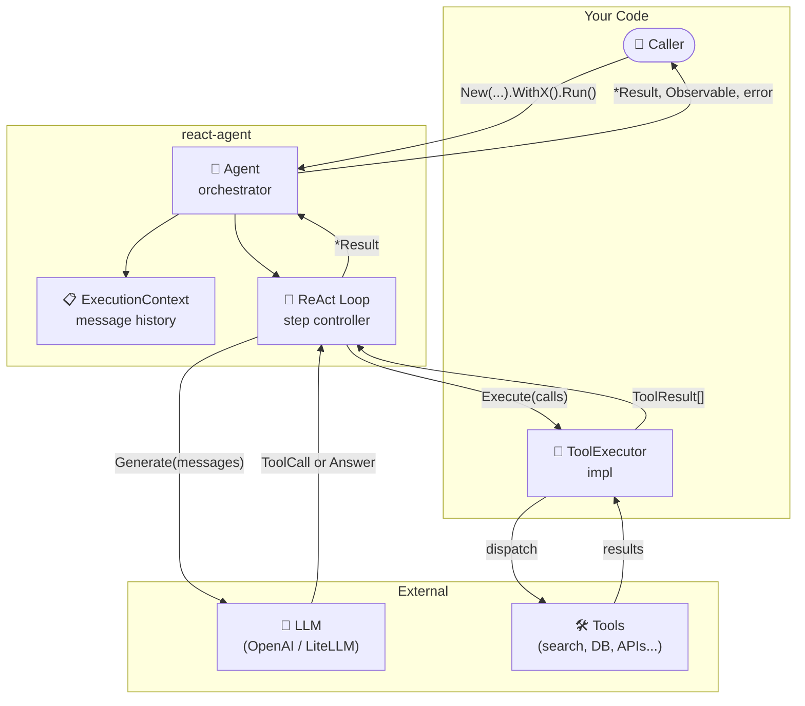
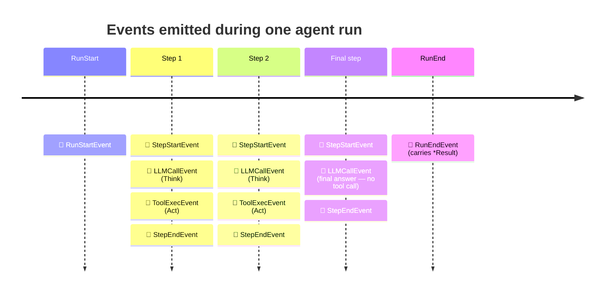
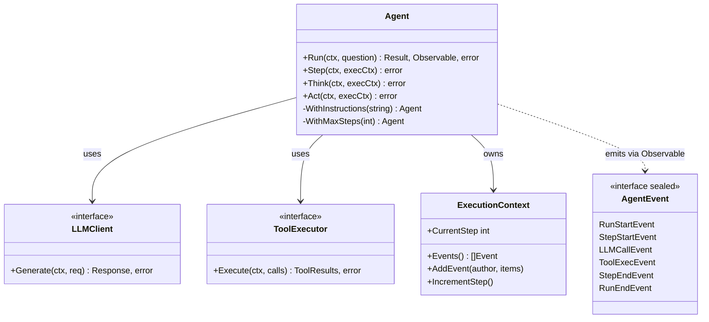

# 🤖 react-agent

[](https://pkg.go.dev/github.com/v8tix/react-agent)
[](https://goreportcard.com/report/github.com/v8tix/react-agent)
[](LICENSE)

**Build AI agents that think before they act.**

Most LLM integrations are one-shot: send a prompt, get an answer. But complex questions require *reasoning* — looking things up, checking results, adjusting the plan. `react-agent` implements the **ReAct pattern** (Reason + Act), a technique where the model alternates between *thinking out loud* and *using tools* until it's confident enough to answer.

> 📄 *Based on ["ReAct: Synergizing Reasoning and Acting in Language Models"](https://arxiv.org/abs/2210.03629) — Yao et al., 2022*

---

## 🧠 What is the ReAct pattern?

> Think of it like a **detective 🕵️** who never guesses. Instead of jumping to a conclusion, they follow a strict method: *form a hypothesis → gather evidence → revise → repeat* until the case is solved.


---

## 🔍 A Concrete Example

> *"What was Apple's stock price the day the iPhone was announced?"*

A one-shot model will **guess**. A ReAct agent will **reason**:



> 💡 Notice how the agent **builds on previous observations** — each step's result is fed back into the next Think. The LLM never loses context.

---

## 📦 Installation

```bash
go get github.com/v8tix/react-agent
```

---

## 🚀 Quick Start

Here's a complete example: a **research assistant** 🔬 that can search the web and do math to answer complex questions.

```go
package main

import (
    "context"
    "fmt"
    "log"

    "github.com/openai/openai-go"
    agent "github.com/v8tix/react-agent"
)

func main() {
    ctx := context.Background()

    // 1️⃣ Wrap your LLM (any OpenAI-compatible endpoint, including LiteLLM)
    openaiClient := openai.NewClient() // reads OPENAI_API_KEY from env
    client := agent.NewLiteLLMClient(openaiClient, "gpt-4o-mini")

    // 2️⃣ Declare the tools the agent can use (OpenAI JSON-schema format)
    defs := []agent.ToolDefinition{
        {
            Name:        "search_web",
            Description: "Search the web for up-to-date information",
            Parameters: map[string]any{
                "type": "object",
                "properties": map[string]any{
                    "query": map[string]any{"type": "string", "description": "The search query"},
                },
                "required": []string{"query"},
            },
        },
        {
            Name:        "calculator",
            Description: "Evaluate a simple arithmetic expression",
            Parameters: map[string]any{
                "type": "object",
                "properties": map[string]any{
                    "expression": map[string]any{"type": "string", "description": "e.g. '42 * 1.2'"},
                },
                "required": []string{"expression"},
            },
        },
    }

    // 3️⃣ Wire up the executor — your code that actually runs the tools
    executor := &myExecutor{}

    // 4️⃣ Build the agent with a fluent builder chain
    a := agent.New(client, defs, executor).
        WithInstructions("You are a precise research assistant. Always verify facts before answering.").
        WithMaxSteps(10)

    // 5️⃣ Run! Returns result, a replayable event stream, and any error.
    result, events, err := a.Run(ctx, "How many seconds did it take the Voyager 1 spacecraft to travel 1 AU?")
    if err != nil {
        log.Fatal(err)
    }

    fmt.Println("🏁 Answer:", result.Output)
    _ = events // see "Observability" section below
}
```

---

## 🏗️ Architecture



---

## 🔧 Implementing ToolExecutor

The only interface you **must** implement:

```go
type ToolExecutor interface {
    Execute(ctx context.Context, calls []agent.ToolCall) ([]agent.ToolResult, error)
}
```

A typical implementation dispatches by tool name:

```go
type myExecutor struct {
    searcher WebSearcher
    calc     Calculator
}

func (e *myExecutor) Execute(ctx context.Context, calls []agent.ToolCall) ([]agent.ToolResult, error) {
    results := make([]agent.ToolResult, len(calls))
    for i, call := range calls {
        output, err := e.dispatch(ctx, call.Name, call.Arguments)
        if err != nil {
            results[i] = agent.ToolResult{
                ID: call.ID, Name: call.Name,
                Status: "error", Content: []string{err.Error()},
            }
            continue
        }
        results[i] = agent.ToolResult{
            ID: call.ID, Name: call.Name,
            Status: "success", Content: []string{output},
        }
    }
    return results, nil
}

func (e *myExecutor) dispatch(ctx context.Context, name, args string) (string, error) {
    switch name {
    case "search_web":
        return e.searcher.Search(ctx, args)
    case "calculator":
        return e.calc.Eval(args)
    default:
        return "", fmt.Errorf("unknown tool: %s", name)
    }
}
```

> 💡 `ToolExecutor` is **the integration seam** — plug in MCP, LangChain tools, a local SQLite, a REST API, anything. The agent doesn't care what's behind it.

---

## 📡 Observability — the Event Stream

`Run()` returns three values:

```go
result, events, err := a.Run(ctx, question)
//        ^^^^^^
//        rxgo.Observable — a replayable stream of everything the agent did
```

### 🌊 What gets emitted



### Event reference

| Event            | Payload highlights           | When emitted                           |
|------------------|------------------------------|----------------------------------------|
| `RunStartEvent`  | `RunID`, `Question`          | Before the loop begins                 |
| `StepStartEvent` | `Step` number                | At the start of each Think→Act cycle   |
| `LLMCallEvent`   | `Latency`, `Err`             | After every `Generate()` call          |
| `ToolExecEvent`  | `ToolNames`, `Latency`, `Err`| After every `Execute()` batch          |
| `StepEndEvent`   | `Step` number                | At the end of each Think→Act cycle     |
| `RunEndEvent`    | `*Result`, `Err`             | On completion or error                 |

### Consuming events

```go
result, events, err := a.Run(ctx, question)
if err != nil {
    log.Fatal(err)
}

// 🔭 Subscribe — cold observable, safe to call multiple times (full replay each time)
for item := range events.Observe() {
    switch e := item.V.(type) {
    case agent.RunStartEvent:
        slog.Info("🚀 agent started", "run_id", e.RunID, "question", e.Question)
    case agent.LLMCallEvent:
        slog.Info("🧠 llm call", "latency_ms", e.Latency.Milliseconds())
    case agent.ToolExecEvent:
        slog.Info("🔧 tool exec", "tools", e.ToolNames, "latency_ms", e.Latency.Milliseconds())
    case agent.RunEndEvent:
        slog.Info("🏁 run finished", "err", e.Err)
    }
}

fmt.Println(result.Output)
```

> 🧊 **Cold & replayable** — the observable uses `rxgo.Defer`. Nothing is emitted until you call `Observe()`. Each `Observe()` call replays all events from scratch, so two separate subscribers (e.g. a logger and a metrics exporter) each see the full picture independently.

---

## 🕹️ Manual Step Control

`Step` is exported so you can drive the loop yourself — useful for streaming UI updates, checkpointing long runs, or **human-in-the-loop** interrupts:

```go
execCtx := agent.NewExecutionContextForTest()
execCtx.AddEvent("user", agent.Message{Role: "user", Content: "Plan a 3-day trip to Kyoto"})

for execCtx.CurrentStep < 15 {
    if err := a.Step(ctx, execCtx); err != nil {
        break
    }

    // 🔍 Inspect what just happened before the next step
    latest := execCtx.Events()[len(execCtx.Events())-1]
    fmt.Printf("Step %d: %s said something\n", execCtx.CurrentStep, latest.Author)

    // 🛑 Human-in-the-loop: pause and ask for approval
    if needsApproval(latest) {
        if !getUserApproval() {
            break
        }
    }

    execCtx.IncrementStep()
}
```

---

## 🔍 Inspecting the Reasoning Trail

Every run keeps a full, ordered history of messages, tool calls, and tool results in `result.Context`:

```go
for _, event := range result.Context.Events() {
    fmt.Printf("[%s] at %s\n", event.Author, event.Timestamp.Format(time.RFC3339))
    for _, item := range event.Content {
        switch v := item.(type) {
        case agent.Message:
            fmt.Printf("  💬 message: %s\n", v.Content)
        case agent.ToolCall:
            fmt.Printf("  🔧 tool_call: %s(%s)\n", v.Name, v.Arguments)
        case agent.ToolResult:
            fmt.Printf("  📊 tool_result: [%s] %v\n", v.Status, v.Content)
        }
    }
}
```

> 💡 Use this for **debugging**, **audit logs**, or displaying the agent's "chain of thought" to end users.

---

## 🏛️ Design Reference



| Type | Role |
|------|------|
| `Agent` | 🤖 Orchestrator — owns the loop |
| `ExecutionContext` | 📋 Mutable run state — thread-safe event log |
| `Event` | 📝 Timestamped history entry (author + content items) |
| `LLMClient` | 🧠 Interface — swap any provider |
| `ToolExecutor` | 🔧 Interface — bring your own dispatch strategy |
| `LiteLLMClient` | 🔌 Concrete adapter for openai-go / LiteLLM proxy |
| `AgentEvent` | 📡 Sealed sum type — emitted on the observable stream |

---

## License

Apache 2.0
